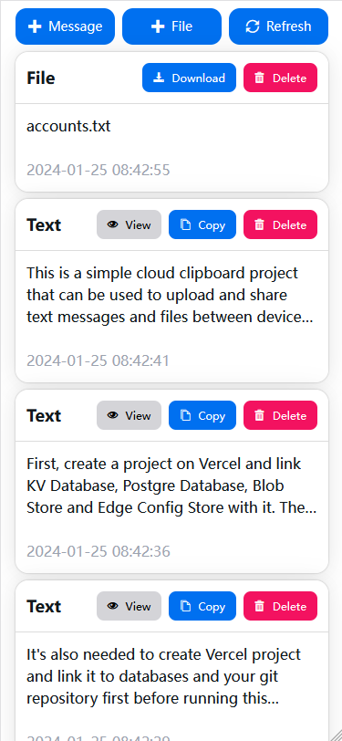

# Vercel Clipboard

This is a simple cloud clipboard project that can be used to upload and share text messages and files between devices. The project is developed with Next.js 14 and deployed on Vercel. It's serverside relies on Vercel's KV Database, Postgre Database, Blob Store and Edge Config Store to persist data and configurations.



## Deploy on Vercel

First, create a project on Vercel and link KV Database, Postgre Database, Blob Store and Edge Config Store with it. Then fork this repository and link it with Vercel project and it will works in a few seconds.

## Running locally

It's also needed to create Vercel project and link it to databases and your git repository first before running this project locally. Then run these following commands to install dependencies and start a development server.

```bash
npm install && npx vercel env pull .env.development.local && npm run dev
```

## Configurations

This project is designed for multi users. If you want others to register, you can configure `allowResigter` as `true` in Edge Config Store then the sign up page will be enabled.
