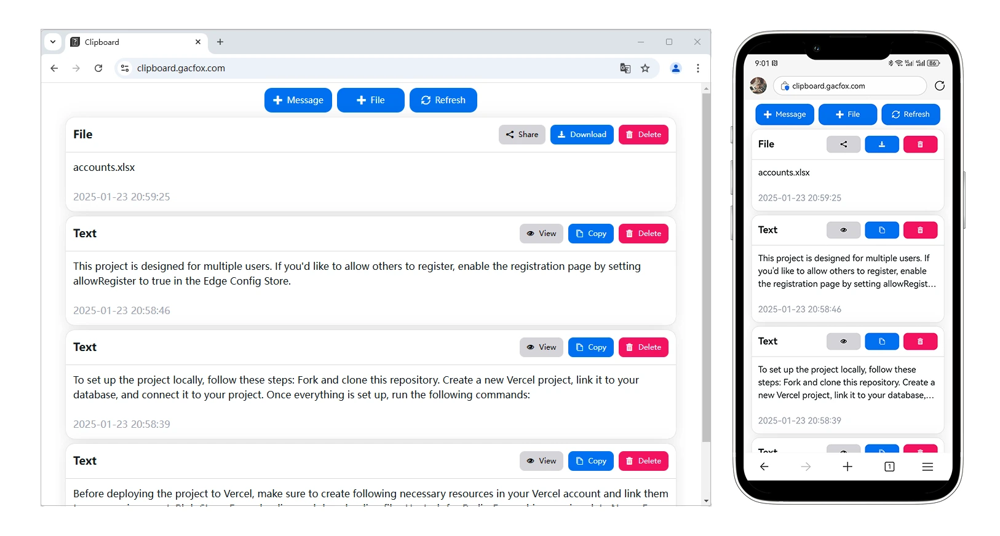

# Vercel Clipboard

Vercel Clipboard is a simple web-based application that allows you to share text and files across multiple devices.

[](https://vercel.com/new/clone?repository-url=https%3A%2F%2Fgithub.com%2Fgacfox%2Fvercel-clipboard)

## Screenshots



## Requirements

- Vercel blob store integration for uploading and downloading files
- Vercel KV integration for caching session data
- Vercel postgres integration for persisting structured data
- Vercel edge config store integration for configurations

## Local Development

Fork and clone this repository. Before starting development, you need to create a vercel project, link it to your database, and connect it to the project. Once everything is ready, run the following commands.

```bash
npm install && npx vercel env pull .env.development.local && npm run dev
```

## Configurations

This project is designed for multi users. If you want others to register, you can configure `allowRegister` as `true` in edge config store then the sign up page will be enabled.
